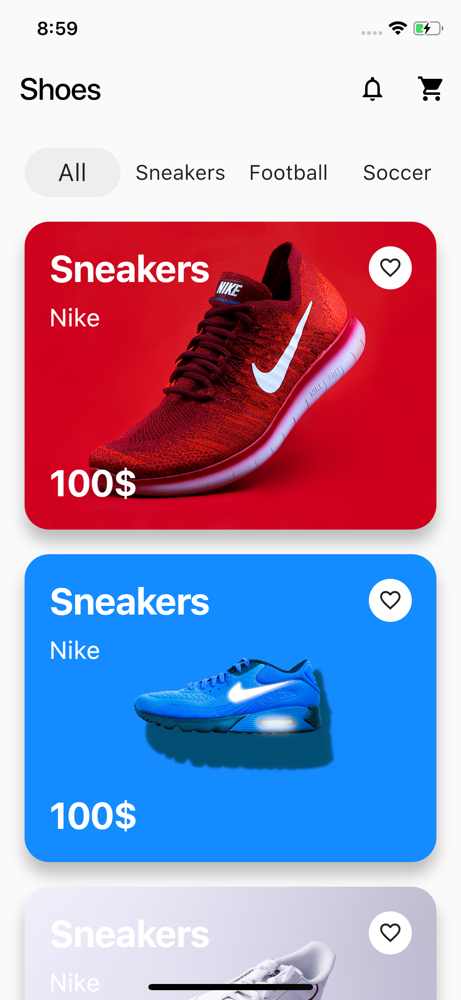

## Flutter Shoes Shop Application UI Design and Animation

Shoes_Shopping_App est une application Flutter conçue pour permettre aux utilisateurs de parcourir et d'acheter des chaussures. L'application est simple et élégante, offrant une expérience utilisateur agréable et fluide.
A part of #flutter100daysofcode. Let's create a beautiful and animated Shoes Shop Application UI with Flutter.

### [Watch it on Youtube](https://youtu.be/lrMCjIYpnjg)

## Development Setup
Clone the repository and run the following commands:
```
flutter pub get
flutter run
```

## ScreenShot

&nbsp;&nbsp;&nbsp;

# Shoes_Shopping_App


## Structure du Projet

Le projet est organisé comme suit :

**lib/** : Contient le code source de l'application.
  - **main.dart** : Le point d'entrée de l'application, où l'initialisation principale de l'application est effectuée.

  - **screen/** : Contient les différentes pages de l'application.
    - **home_page.dart** : Définit la page d'accueil de l'application, où les utilisateurs peuvent voir les chaussures disponibles.
    - **shoes.dart** : Définit le modèle de données pour une chaussure et les widgets associés pour afficher les détails d'une chaussure spécifique.

  - **animation/** : Contient les animations utilisées dans l'application.
    - **fade_animation.dart** : Fournit une animation de fondu pour des transitions fluides entre les différents écrans de l'application.

## Description des fichiers

<details>
<summary>1.1 main.dart</summary>

- **main.dart** :
    - Ce fichier constitue le point d'entrée de l'application. Il contient la fonction `main()` qui appelle `runApp()`. `ShoesShoppingApp` est la classe principale qui englobe l'application entière. Elle utilise un `MaterialApp` pour définir la structure de navigation de l'application.
    - Le `MaterialApp` a pour `home` la `HomePage`, qui est la première page affichée lorsque l'application démarre.

</details>

<details>
<summary>1.2 home_page.dart</summary>

- **home_page.dart** :
    - Ce fichier contient la définition de la `HomePage`, qui est la page d'accueil de l'application. Cette page présente la liste des chaussures disponibles.
    - La `HomePage` utilise un `GridView.builder` pour afficher les chaussures sous forme de grille. Chaque élément de la grille est une instance de `ShoesWidget`, qui affiche les informations d'une chaussure particulière, telles que l'image, le nom et le prix.
    - Un `AppBar` personnalisé est utilisé pour le titre de la page, avec une icône de panier permettant aux utilisateurs d'accéder à leur panier d'achat.

</details>

<details>
<summary>1.3 shoes.dart</summary>

- **shoes.dart** :
    - Ce fichier contient la définition du modèle de données `Shoe`, qui représente une chaussure dans l'application.
    - La classe `Shoe` comprend des propriétés comme `name`, `price`, `image`, et `description`, qui définissent les caractéristiques d'une chaussure.
    - `ShoesWidget` est un widget qui prend une instance de `Shoe` en paramètre et l'affiche sous forme de carte avec l'image, le nom et le prix de la chaussure.

</details>

<details>
<summary>1.4 fade_animation.dart</summary>

- **fade_animation.dart** :
    - Ce fichier définit une animation de fondu appelée `FadeAnimation`. Cette animation est utilisée pour rendre les transitions entre les pages de l'application plus fluides.
    - `FadeAnimation` utilise un `AnimatedOpacity` pour gérer l'opacité du widget cible. L'animation commence par une opacité faible et augmente progressivement jusqu'à une opacité totale, créant un effet de fondu.
    - Cette animation est utile pour des transitions subtiles et est souvent utilisée lors du changement d'écrans ou de l'affichage de nouveaux éléments.

</details>
